# PSET2 
-- Esse PSET2 foi realizado de acordo com as aulas apresentadas sobre algebra relacional --

## Questão 01
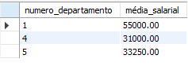 

## Questão 02
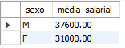

## Questão 03
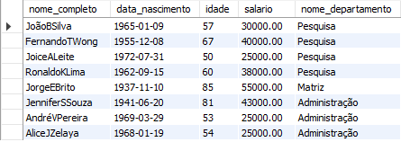 

## Questão 04
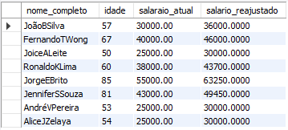

## Questão 05
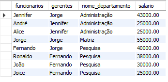

## Questão 06
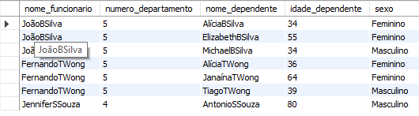

## Questão 07
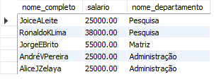

## Questão 08
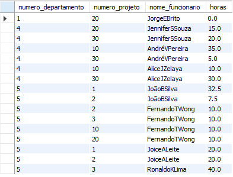

## Questão 09
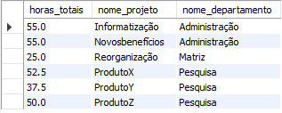

## Questão 10
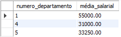

## Questão 11
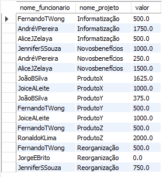

## Questão 12
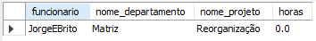 

## Questão 13
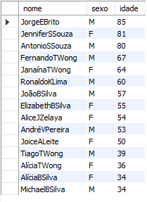 

## Questão 14
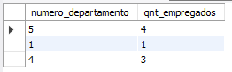 

## Questão 15
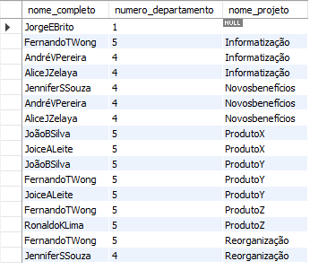 
